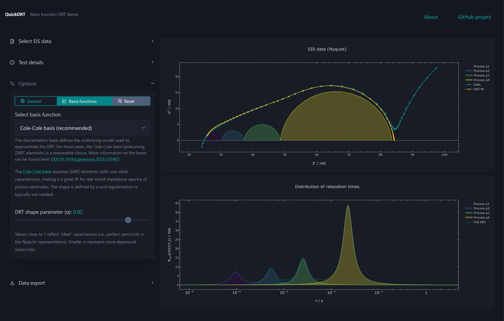

# QuickDRT
A browser-based tool for computing distribution of relaxation times (DRT) functions from measured impedance spectroscopy (EIS) data.
No installation, no Python backend - just open it in your browser.

**[Try it live here](https://robertleonhardt.github.io/QuickDRT/)**

## Main features

- **In-depth analysis of EIS data** - Deconvolute your impedance spectra to obtain valuable insights into the underlying capacitive-resistive processes.
- **Automatic process separation** - As the DRTs are approximated using dispersed basis functions, the resulting functions can easily be dissected. This, in turn, yields the precise contribution of singular processes, simplifying aging analysis significantly.
- **Interactive and real-time visualization** - Real-time plot updates when settings are adjusted (e.g., when shape parameters are tuned). 
- **Data export** - The DRTs, the reconstructed process impedance spectra, and the plots can easily be exported for use in PowerPoint, etc.
- **Runs everywhere** - QuickDRT works offline (e.g., on lab computers), on mobile, and without any external dependencies.
- **Gamry .dta support** - Native support for Gamry impedance spectra. 

## Getting started

**Online:** Open the [live demo](https://robertleonhardt.github.io/QuickDRT/) and drop your EIS file onto the upload area.

**Offline:** Download or clone this repository and open `index.html` in your browser.

## Supported file formats

- **Gamry .DTA** - Native support for most Gamry EIS files.
- **Generic CSV** - You can also use QuickDRT with *.csv files with the following generic header: `frequency_Hz`, `z_real_Ohm`, `z_imag_Ohm`. Optionally, a JSON metadata header can be prepended to the CSV data (i.e., at line 1, followed by the CSV data).

Soo the in-app "Supported data types" information for the CSV specs.

## How it works

QuickDRT reconstructs the DRT by discretizing the impedance data using analytical basis functions (Cole-Cole, Havriliak-Negami, and Gauss). This approach yields clean per-process separation while mitigating the need for Tikhonov regularization.

For more beackground information on the process and the used basis functions, see the [underlying publication](https://doi.org/10.1016/j.jpowsour.2025.237403) and the [PyDRT documentation](https://github.com/robertleonhardt/PyDRT).

## Citation

If QuickDRT is useful to your research, please cite:

> Leonhardt, et al. (2025). "Reconstructing the distribution of relaxation times with analytical basis functions" Journal of Power Sources 652, DOI: 10.1016/j.jpowsour.2025.237403
[DOI:10.1016/j.jpowsour.2025.237403](https://doi.org/10.1016/j.jpowsour.2025.237403)

## Acknowledgements

> Wan, T. H., et al. (2015). "Influence of the Discretization Methods on the Distribution of Relaxation Times Deconvolution: Implementing Radial Basis Functions with DRTtools." Electrochimica Acta 184: 483-499.

and, as the main source for the implementation of the Cole-Cole and Havriliak-Negami bases, 
> T. Tichter. https://github.com/Polarographica/Polarographica_program

## License

[CC BY-NC 4.0](https://creativecommons.org/licenses/by-nc/4.0/)
